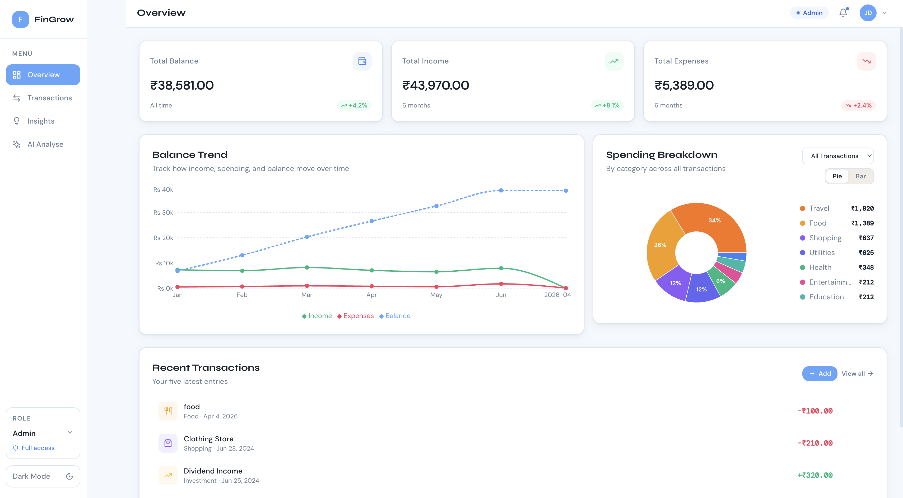

# FinanceOS — Finance Dashboard

A production-quality Finance Dashboard built with React, Tailwind CSS, Recharts, and Zustand.

---

## 🚀 Setup Instructions

### Prerequisites
- Node.js 18+
- npm 9+

### Install & Run

```bash
# 1. Navigate to the project folder
cd finance-dashboard

# 2. Install dependencies
npm install

# 3. Start the dev server
npm run dev
```

Open `http://localhost:5173` in your browser.

### Build for Production

```bash
npm run build
npm run preview
```

---

## 📦 Features

### 1. Dashboard Overview
- **3 Summary Cards** — Total Balance, Income, and Expenses with trend badges
- **Balance Trend Line Chart** — Monthly income, expense, and balance over 6 months
- **Spending Breakdown** — Pie chart and horizontal bar chart (toggleable) by category
- **Recent Transactions** — Last 5 transactions with quick-access Add button

### 2. Transactions Page
- Full paginated transaction list with category icon, description, date, and color-coded amount
- **Search** — Live full-text search across description and category
- **Filter by Category** — Dropdown to filter by any category
- **Filter by Type** — Toggle between All / Income / Expense
- **Sort** — By date or amount, ascending or descending
- **Export** — Download filtered transactions as CSV or JSON
- **Admin-only**: Inline Edit and Delete buttons (hover to reveal)

### 3. Role-Based UI
- **Admin** — Can add, edit, and delete transactions
- **Viewer** — Read-only access; all mutation controls are hidden
- Switch roles from the sidebar dropdown at any time

### 4. Insights Page
- **Savings Health Ring** — Visual savings rate with contextual advice
- **Top Spending Category** — Highest spend category by total amount
- **Most Frequent Category** — Category with the most transactions
- **Average Monthly Expense** — Mean expense across tracked months
- **Month-over-Month Comparison** — Expense and income change from last month
- **Monthly Bar Chart** — Side-by-side income / expense / savings per month

### 5. State Management (Zustand)
- Centralized store with `transactions`, `role`, `filters`, `activePage`, `darkMode`
- `getFilteredTransactions()` — computed selector combining all filters
- `getSummary()` — computed income/expense/balance totals
- **LocalStorage persistence** — role, transactions, and dark mode survive page refreshes

### 6. UI/UX
- **Dark Mode** — Toggle in sidebar, persisted to localStorage
- **Fully Responsive** — Mobile drawer sidebar + adaptive grid layouts
- **Empty States** — Graceful empty state when no transactions match filters
- **Animations** — Staggered card entrance animations, smooth transitions
- **Accessible** — Focus rings, semantic HTML, keyboard-navigable

---

## 🧱 Project Structure

```
src/
├── components/
│   ├── BalanceChart.jsx      # Line chart — balance trend
│   ├── Header.jsx            # Top navigation bar
│   ├── Sidebar.jsx           # Left nav, role switcher, dark mode
│   ├── SpendingChart.jsx     # Pie + bar chart for categories
│   ├── StatCard.jsx          # Reusable summary metric card
│   ├── TransactionList.jsx   # Transaction rows with admin actions
│   └── TransactionModal.jsx  # Add / edit transaction form modal
├── pages/
│   ├── Overview.jsx          # Main dashboard page
│   ├── Transactions.jsx      # Full transaction management
│   └── Insights.jsx          # Financial insights & analytics
├── store/
│   └── useStore.js           # Zustand store (global state)
├── hooks/
│   └── useFinanceData.js     # Derived data hooks (monthly, category, insights)
├── utils/
│   └── helpers.js            # formatCurrency, formatDate, exportCSV, exportJSON
├── data/
│   └── mockData.js           # 66 static mock transactions + category colors
├── App.jsx                   # Root layout + page router
├── main.jsx                  # React entry point
└── index.css                 # CSS variables, Tailwind, global styles
```

---

## 🛠 Tech Stack

| Tool         | Purpose                              |
|--------------|--------------------------------------|
| React 18     | UI framework with hooks              |
| Vite 5       | Lightning-fast dev server & bundler  |
| Tailwind CSS | Utility-first styling                |
| Recharts     | Line, bar, and pie charts            |
| Zustand      | Lightweight global state with devtools |
| Lucide React | Consistent icon set                  |

---

## 🎨 Design

- **Fonts**: Syne (display headings) + DM Sans (body) + DM Mono (amounts)
- **Theme**: Warm off-white / deep charcoal with amber accent — light & dark
- **Color coding**: Green = income, Rose = expense, Amber = accent/balance
- CSS custom properties (`--c-bg`, `--c-accent`, etc.) power both themes

---

## 🗺 Potential Enhancements

- Backend integration (REST / GraphQL)
- Pagination for large transaction lists
- Budget goals and limit tracking
- Recurring transaction detection
- Multi-currency support
